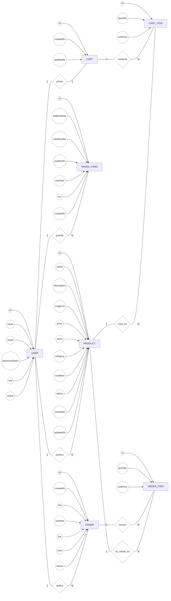
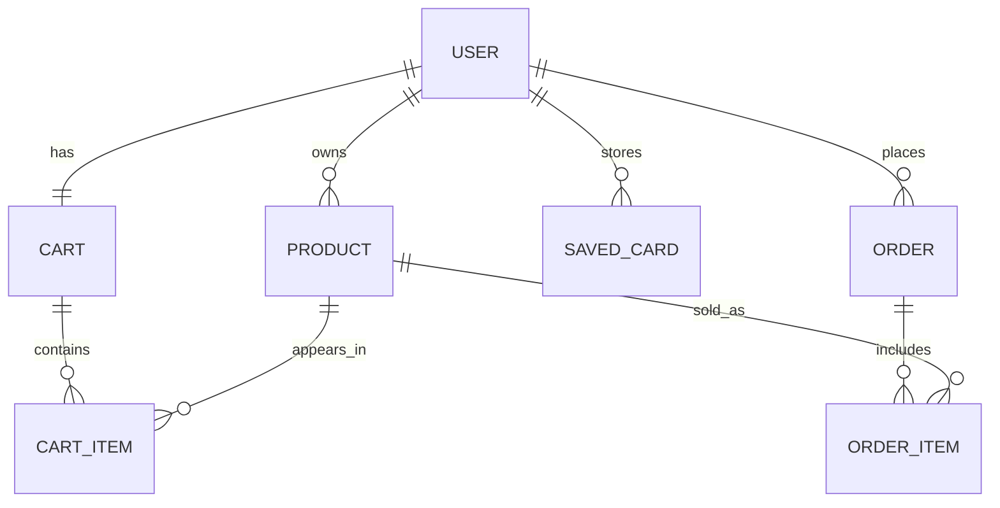

# Modelo de Datos (Conceptual, Lógico y Físico)

Este documento resume el **esquema conceptual (Peter‑Chen)**, el **esquema lógico (relacional)** y apunta al **esquema físico (PostgreSQL)** usado por el proyecto.

---

## 1) Esquema Conceptual — Notación Peter‑Chen

**Entidades y atributos (Peter‑Chen)**



**Relaciones (cardinalidades)**
- USER **1..N** —publica→ **PRODUCT**  (PRODUCT.owner = USER.id)
- USER **1..1** —posee→ **CART**  (CART.owner = USER.id)
- CART **1..N** —contiene→ **CART_ITEM**  (CART_ITEM.cart = CART.id)
- PRODUCT **1..N** —está_en→ **CART_ITEM**  (CART_ITEM.product = PRODUCT.id)
- USER **1..N** —guarda→ **SAVED_CARD**  (SAVED_CARD.owner = USER.id)
- USER **1..N** —realiza→ **ORDER**  (ORDER.buyer = USER.id)
- ORDER **1..N** —incluye→ **ORDER_ITEM**  (ORDER_ITEM.order = ORDER.id)
- PRODUCT **1..N** —se_vende_en→ **ORDER_ITEM**  (ORDER_ITEM.product = PRODUCT.id)

> Dominios: 
> - `role ∈ {ADMIN, MODERATOR, LOGISTICS, COMMON}`
> - `product.status ∈ {PENDING, APPROVED, REJECTED}`
> - `product.condition ∈ {NEW, USED}`
> - `product.category ∈ {TECHNOLOGY, HOME, ACADEMIC, PERSONAL, DECORATION, OTHER}`
> - `order.status ∈ {PLACED, SHIPPED, DELIVERED}`

> **Nota**: Si tu visor soporta Mermaid, puedes renderizar un ER rápido:
>
> ```mermaid
> erDiagram
>   USER ||--o{ PRODUCT : owns
>   USER ||--|| CART : has
>   CART ||--o{ CART_ITEM : contains
>   PRODUCT ||--o{ CART_ITEM : appears_in
>   USER ||--o{ SAVED_CARD : stores
>   USER ||--o{ ORDER : places
>   ORDER ||--o{ ORDER_ITEM : includes
>   PRODUCT ||--o{ ORDER_ITEM : sold_as
> ```

---

## 2) Esquema Lógico — Relacional

**USER**(id PK, name, email UQ, password_hash, role, active, created_at, updated_at)

**PRODUCT**(id PK, owner_id FK→USER.id, name, description, image_url, price, stock, category, condition, status, created_at, updated_at)

**SAVED_CARD**(id PK, owner_id FK→USER.id, holder_name, card_number, exp_month, exp_year, cvv, created_at)

**CART**(id PK, owner_id FK→USER.id, created_at, updated_at, UQ(owner_id))

**CART_ITEM**(id PK, cart_id FK→CART.id, product_id FK→PRODUCT.id, quantity, unit_price, UQ(cart_id, product_id))

**ORDER**(id PK, buyer_id FK→USER.id, created_at, eta, subtotal, fee, status, total)

**ORDER_ITEM**(id PK, order_id FK→ORDER.id, product_id FK→PRODUCT.id, quantity, unit_price)

**Índices sugeridos**
- `PRODUCT(status, category)`
- `ORDER(buyer_id, created_at)`
- `ORDER_ITEM(product_id)`
- `CART_ITEM(cart_id)`
- `SAVED_CARD(owner_id)`



---

## 3) Esquema Físico — PostgreSQL

La definición DDL completa está en: `db/schema.sql`

Incluye:
- `CHECK` para dominios (roles, estatus, categorías, etc.)
- Claves foráneas con `ON UPDATE CASCADE` y `ON DELETE` apropiado
- Índices y restricciones `UNIQUE`
- Seeds mínimos comentados

---

## 4) Notas de implementación
- Los cambios de **status** en `Product` implican flujo de moderación.
- En `Order`, `status` inicia en `PLACED` y avanza a `SHIPPED`/`DELIVERED` por logística.
- El **split** de ingresos (95% vendedor, 5% plataforma) se calcula a nivel de servicio (checkout/reportes), no se persiste como columnas separadas por simplicidad.
